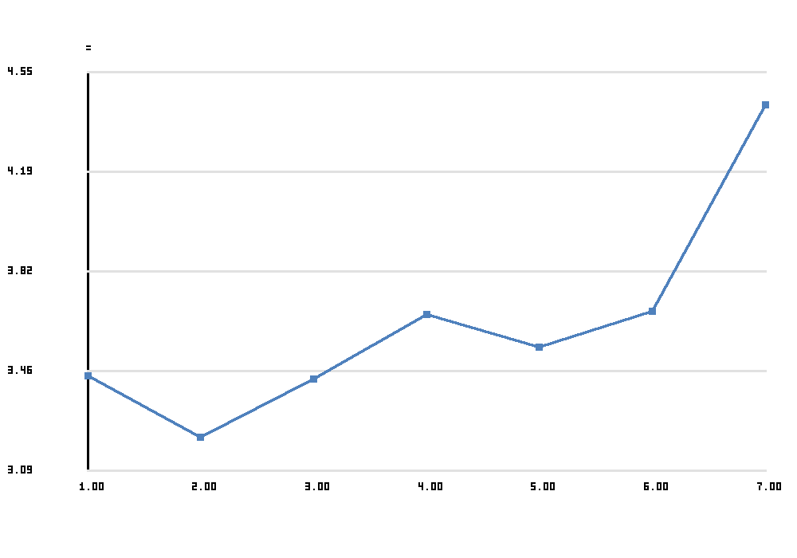
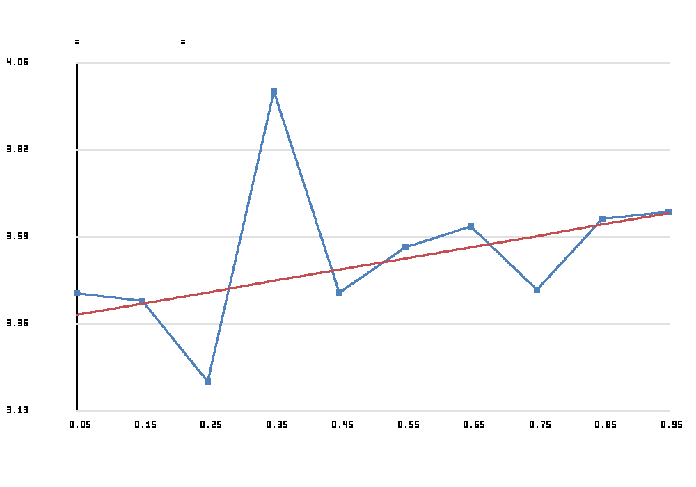
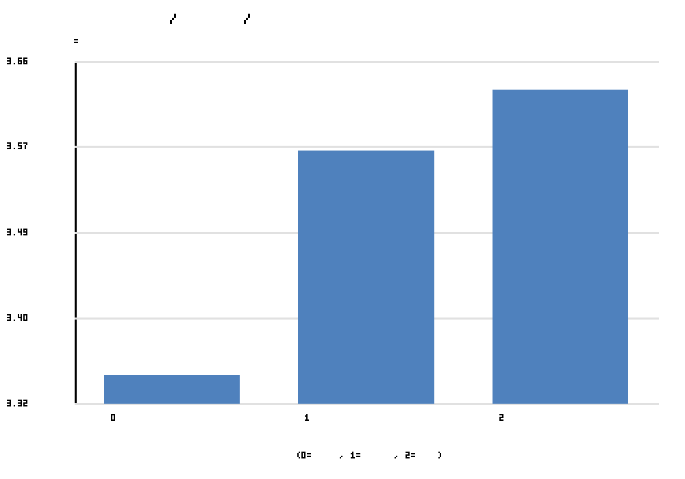
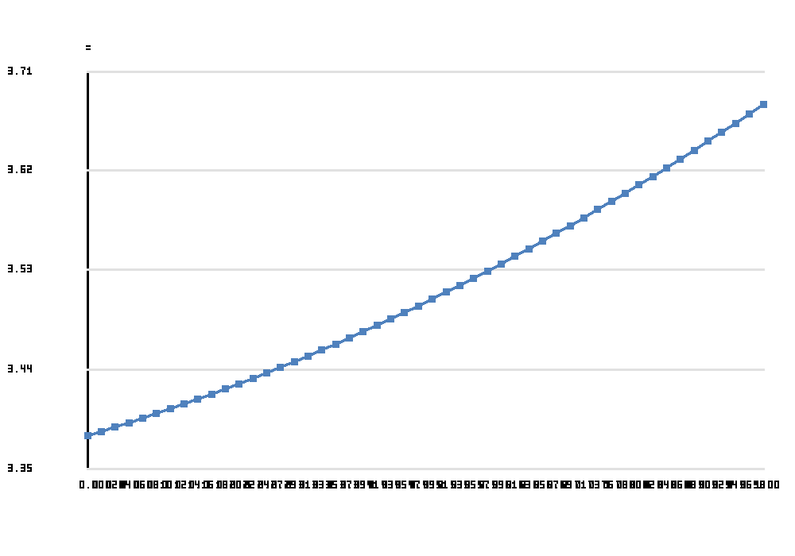
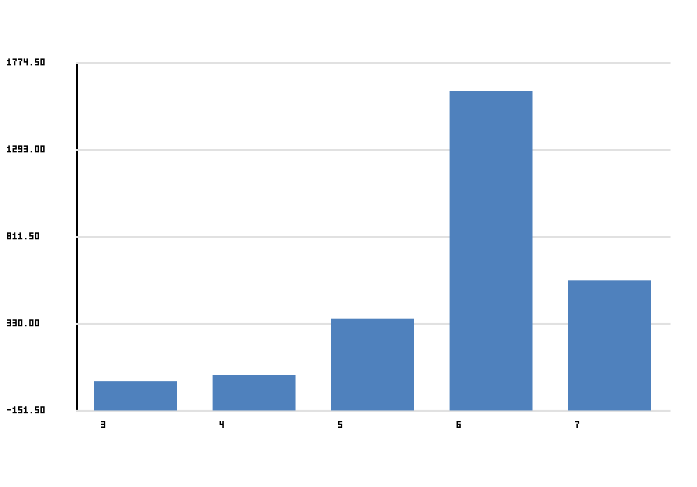

# Speaking Order Bias In Extemporaneous Speaking

This project studies whether speaking order is associated with judge-assigned rank in extemporaneous speaking rounds collected from Tabroom ballot pages tied to a Gabrielino-attended tournament set.

## Results

The current analysis suggests a small **primacy bias**: earlier speakers tended to receive slightly better ranks on average. The effect is statistically detectable in the linear model, but the overall explained variance is still small.



Average rank by raw speaking position. Lower rank is better, so lower values for earlier positions are consistent with primacy rather than recency.



Average rank by normalized speaking position with a fitted line. The positive slope indicates that later positions were associated with worse ranks on average.



This groups speakers into early, middle, and late positions. The early bin performed best on average, while the late bin performed worst.



This curve shows the quadratic model fit across the speaking-order range. In this dataset, the curve does not suggest a strong extra edge effect beyond the main linear trend.



Most observations come from panels of five to seven speakers. That matters because the normalized-position analysis depends on panel size.

## Data Source

The source data comes from Tabroom round-results ballot pages that include competitor names, judges, speaking order, and ranks.

## What Was Measured

- Speaking position within a judge panel
- Judge-assigned rank, where lower rank is better
- Normalized speaking position and early / middle / late bins

## How To Interpret Results

- Negative slope on normalized position suggests recency bias
- Positive slope suggests primacy bias
- A meaningful quadratic term suggests edge effects

Current high-level result: **primacy bias**.

## Files

- `02_gabrielino_raw_round_data.csv`: extracted raw competitor-by-judge rows
- `03_cleaned_data.csv`: cleaned analysis dataset
- `03_model_results.csv`: regression outputs
- `03_analysis_summary.md`: concise results summary
- `figures/`: analysis figures
- `site/`: GitHub Pages-ready static site

## View The Site Locally

```bash
cd /Users/minnalkunnan/Desktop/research/extemp_analysis
python -m http.server 8000
```

Then open `http://localhost:8000/site/`.

## Publish With GitHub Pages

```bash
cd /Users/minnalkunnan/Desktop/research/extemp_analysis
git init
git add .
git commit -m "Add speaking-order bias analysis site"
git branch -M main
git remote add origin <YOUR_REPO_URL>
git push -u origin main
```

Then enable GitHub Pages in the repository settings and set the source to deploy from the `main` branch, `/site` folder if using a Pages action or the root branch if you publish the built site as configured in your repo workflow.
